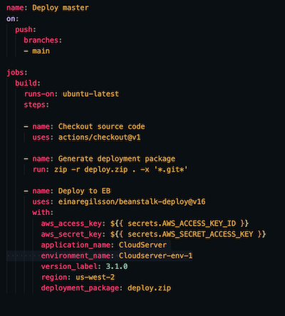

# cloud-server

Author: Jessi Velazquez

Deployed Link (Elastic Beanstock via AWS/terminal): [http://cloudserver-environment.eba-4s4t9zju.us-west-2.elasticbeanstalk.com/](http://cloudserver-environment.eba-4s4t9zju.us-west-2.elasticbeanstalk.com/)

Deployed Link (auto deploy via Github Actions): [http://cloudserver-env-1.eba-rqcbfqgk.us-west-2.elasticbeanstalk.com/](http://cloudserver-env-1.eba-rqcbfqgk.us-west-2.elasticbeanstalk.com/)

Pull Request: [https://github.com/JessiVelazquez/cloud-server/pull/4](https://github.com/JessiVelazquez/cloud-server/pull/4)

Github Actions: [https://github.com/JessiVelazquez/cloud-server/actions](https://github.com/JessiVelazquez/cloud-server/actions)

## Overview and Description

This is a basic API server application that is being deployed three different ways to Amazon Web Services (AWS):

1. Manually via AWS website

2. Via Elastic Beanstock (EB) and AWS command line interface (CLI) in the terminal

3. Auto-deploy to AWS via GitHub Actions

## Setup

- Clone the repository from this link:

[https://github.com/JessiVelazquez/cloud-server](https://github.com/JessiVelazquez/cloud-server)

- Deploy at AWS by creating a new environment and then uploading the server.zip file within the repository

- Deploy via terminal using EB and AWS CLI's

- Create a Github Workflow .yml file with the code pictured below, and then add/commit/push code to Github repository. Click on the "Actions" tab to see the process run, which will include an auto-deployment of the file.



- You can check the live versions of your deployment by going to your "environments" tab on AWS and clicking on the deployed links.

## Dependencies

- cors

- express

- faker

- socket.io.client

## Run the Application

This lab is all about deployed links, but to run the server locally, run the following command in the terminal:

```
npm start
```

## UML


