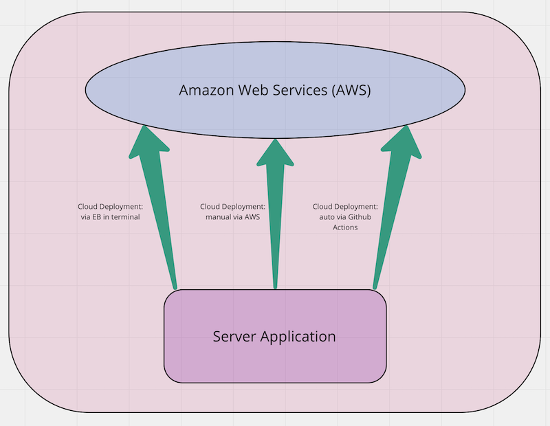

# cloud-server

Author: Jessi Velazquez

Deployed Link (Elastic Beanstock via AWS/terminal): [http://cloudserver-environment.eba-4s4t9zju.us-west-2.elasticbeanstalk.com/](http://cloudserver-environment.eba-4s4t9zju.us-west-2.elasticbeanstalk.com/)

Deployed Link (auto deploy via Github Actions): [http://cloudserver-env-1.eba-rqcbfqgk.us-west-2.elasticbeanstalk.com/](http://cloudserver-env-1.eba-rqcbfqgk.us-west-2.elasticbeanstalk.com/)

Pull Request: [https://github.com/JessiVelazquez/cloud-server/pull/4](https://github.com/JessiVelazquez/cloud-server/pull/4)

Github Actions: [https://github.com/JessiVelazquez/cloud-server/actions](https://github.com/JessiVelazquez/cloud-server/actions)

## Overview and Description

This is a basic API server application that is being deployed three different ways to Amazon Web Services (AWS):

1. Manually via AWS website

2. Via Elastic Beanstock (EB) and AWS command line interface (CLI) in the terminal

3. Auto-deploy to AWS via GitHub Actions

## SETUP

### From Class Repo (Saving here for later reference):

Elastic Beanstalk (EB) will automatically wire up essential AWS services to create and deploy a running application.

For Node.js applications, this is generally just going to be an EC2 server instance along with an S3 bucket that stores our files

There are 2 ways to create a new application with EB, detailed below. Either way, all of your environments and applications will be available in the AWS Developer Console (GUI) for you to manage

### Creating an application with the Elastic Beanstalk GUI

- Choose NodeJS as your platform
- Create and upload a .zip file with your application source code
  - Do not include `node_modules` or `package-lock.json`

This will create your application and environment in one step, giving you a full GUI from where you can manage the app


### Creating an application using the command line only

First, ensure that you've installed the [AWS CLI](https://docs.aws.amazon.com/cli/latest/userguide/cli-chap-install.html) and the [aws eb](https://docs.aws.amazon.com/elasticbeanstalk/latest/dg/eb-cli3-install.html) command line utilities.

1. `eb init` - Initializes your folder as an Elastic Beanstalk application
   - Choose your region (`us-west-2`)
   - Choose `[Create new Application]`
     - Note: If you already have an application, you could also choose that to connect
   - Answer the other questions as appropriate
     - Choose Node.js at the correct version
1. `eb create my-environment-name` - Create an "environment" for your app to reside in
1. `eb deploy` to deploy your new application to your new environment
   - You'll also use this whenever you make code changes

You can then use some other `eb` commands to manage your apps

- `eb open` to open your app in the browser
- `eb list` to get a list of apps
- `eb ssh` to ssh (login) to one of your apps
- `eb health` to get a health check on  your environments

### Auto-Deploy

You can also use GitHub Actions to auto-deploy your source code to your EB Environment whenever you check in your code.

> Browse the GitHub Marketplace for actions you can import into your repo. There are many

## Additional Notes

- Clone the repository from this link:

[https://github.com/JessiVelazquez/cloud-server](https://github.com/JessiVelazquez/cloud-server)

- Deploy at AWS by creating a new environment and then uploading the server.zip file within the repository

- Deploy via terminal using EB and AWS CLI's

- Create a Github Workflow .yml file with the code pictured below, and then add/commit/push code to Github repository. Click on the "Actions" tab to see the process run, which will include an auto-deployment of the file.


- You can check the live versions of your deployment by going to your "environments" tab on AWS and clicking on the deployed links.

## Dependencies

- cors

- express

- faker

- socket.io.client

## Run the Application

This lab is all about deployed links, but to run the server locally, run the following command in the terminal:

```
npm start
```

## UML


